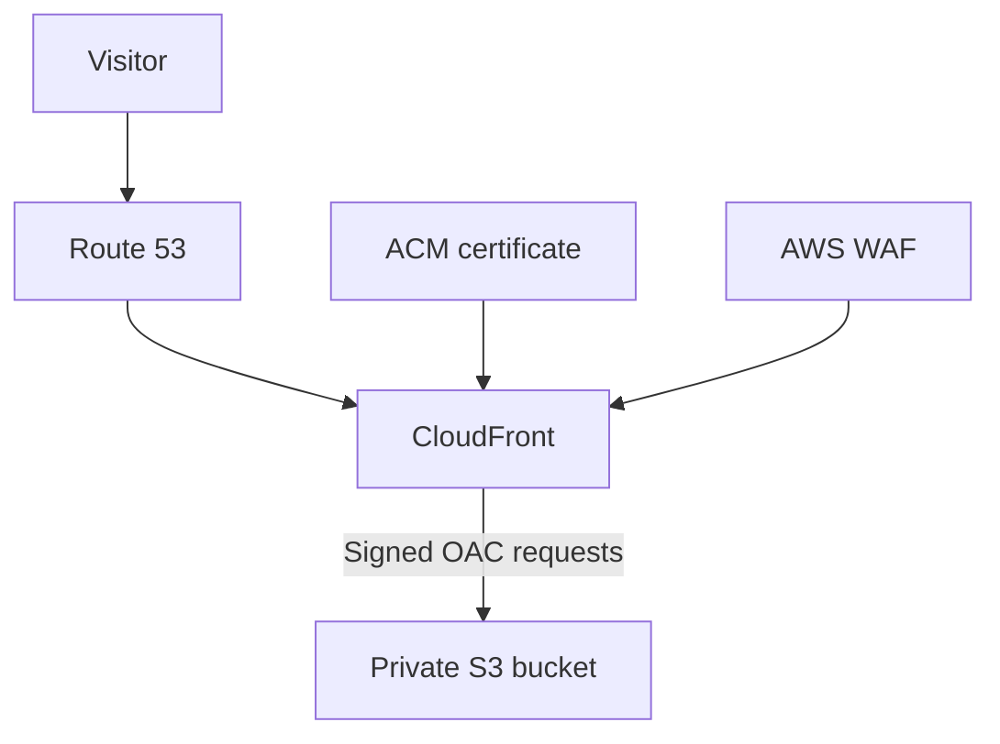

# Operations and maintenance guide

Terraform manages an existing AWS static-site environment adopted through imports.
The site uses a private S3 bucket in eu-central-1. CloudFront signs origin requests
with OAC. ACM provides TLS; its certificate and the CloudFront WAF are in us-east-1.
Route 53 provides apex and www aliases for IPv4 and IPv6.



## Requirements and authentication

Terraform >= 1.10 and < 2.0 is required for S3 native state locking. The provider
constraint permits AWS 6.x; `.terraform.lock.hcl` selects the reviewed version
6.67.0. Commit the lock file. Do not run `init -upgrade` during this refactor.

AWS credentials must be available in the shell running Terraform. In the current
WSL arrangement these exports reuse the Windows credential files and must be run
in each new shell unless you intentionally configure another authentication method:

```bash
export AWS_SHARED_CREDENTIALS_FILE=/mnt/c/Users/baris/.aws/credentials
export AWS_CONFIG_FILE=/mnt/c/Users/baris/.aws/config
aws sts get-caller-identity
```

Check account 997241705349. Credentials, state, saved plans and private variable
files do not belong in Git. GitHub stores configuration and history, not state.
Use `/home/baris/projects/baris-hu-terraform` as the active checkout.

## Files and dependencies

- `main.tf`: Terraform requirements, providers and website bucket.
- `cloudfront.tf`, `oac.tf`, `acm.tf`: delivery, signed origin access and TLS.
- `route53.tf`, `dns.tf`: hosted zone and records, including certificate validation.
- `security.tf`, `versioning.tf`: S3 controls and managed WAF rules.
- `variables.tf`, `outputs.tf`: a small set of inputs and useful deployment outputs.
- `imports.tf`: the existing environment's adoption history. These fixed import
  IDs are intentional. Imported addresses already in state are not imported again.
- `setup/`: inactive templates for creating state storage and enabling its backend.

Resource references connect the bucket policy and DNS aliases to CloudFront.
The existing resource names are preserved, so file reorganization needs no state
moves. ACM validation values come from the certificate; the apex and wildcard
share one validation resource. Inputs have defaults for this existing environment;
this is not a generic multi-site module. Changing domain/account/region requires
an infrastructure migration and review of historical imports and retained names.

## Normal workflow

```bash
terraform fmt -check
terraform validate
terraform plan -out=review.tfplan
terraform show review.tfplan
# Apply only the reviewed, expected actions:
terraform apply review.tfplan
```

A `.tfplan` file is a saved execution plan, not Terraform source. It contains
sensitive infrastructure details and must stay out of Git. Generate a fresh plan
if state changes; a previously applied plan cannot be reused.

## State storage

Before migration state is local. Follow `REFINEMENT.md` to create a separate
private, encrypted, versioned bucket, then migrate state with S3 native locking.
The bucket is managed in the same root configuration and state as the website.
This avoids introducing a second local bootstrap state to maintain. Once migrated,
that state also contains the bucket's own resource entries. `prevent_destroy`
protects the bucket while its resource declaration exists; it is not an AWS-level
protection against console deletion or removal of the declaration.

The state bucket has no version-expiration rule. Its object versions provide
recovery points. Authorized users can still read state; SSE-S3 encryption does not
replace IAM access controls. The TLS-only bucket policy denies insecure transport
but does not grant access. Backend access needs bucket ListBucket, state-object
GetObject/PutObject, and lock-object GetObject/PutObject/DeleteObject. Provisioning
also needs the appropriate S3 configuration permissions. Credentials stay outside
backend configuration.

After migration, a new checkout runs `terraform init` and uses the same backend.
Do not upload an old local state, use `state push`, or operate the old Windows copy
against an independent state. For recovery, preserve the current state and inspect
S3 versions before restoring a known-good version with its related configuration.
Never delete a lock until you have established that its operation is no longer running.

## Decisions retained for a separate change

The current configuration includes destruction guards, AWS-created NS/SOA records,
PriceClass_All, and 403/404 responses mapped to index.html with status 200. It also
has no custom response headers or noncurrent-version expiration rule.

- Removing NS/SOA management requires a state-only handoff (`removed` with
  `destroy = false`), never a plan deleting the DNS records.
- Keep the current error handling until application routing is confirmed. A normal
  missing page and a client-side route may need different treatment.
- Choose HSTS scope and CSP after checking the website's subdomains and assets.
- Decide rollback retention before enabling noncurrent-version expiration, which
  permanently deletes old content.
- Review destruction guards when planning replacements, especially certificates.
- Confirm the CloudFront billing plan before making WAF or price-class changes.

These are follow-up design decisions, not silently bundled into the refactor.
