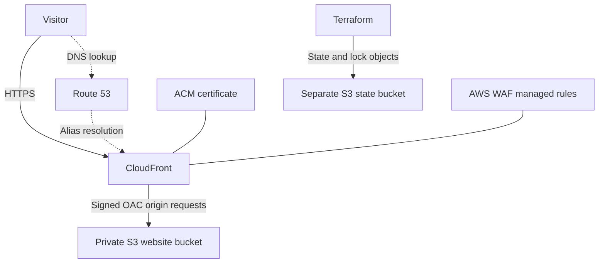

# baris.hu | AWS Infrastructure with Terraform

An AWS-hosted personal portfolio, with its existing infrastructure brought under Terraform management. This project demonstrates infrastructure adoption, private origin access, DNS and TLS configuration, and remote state management.

**[Visit baris.hu](https://baris.hu/) · [LinkedIn](https://www.linkedin.com/in/muhammedbarisekinci)**

## Project overview

The goal was to make an existing website infrastructure maintainable through version-controlled configuration, while preserving its intended behaviour. Instead of rebuilding the environment, I used Terraform imports to adopt existing AWS resources and replaced fixed resource IDs with references between resources.

The repository includes a dedicated S3 backend configuration with encryption, versioning and native state locking. It is tailored to baris.hu rather than packaged as a reusable module.

## Architecture

Route 53 resolves the domain; it does not proxy HTTP traffic. CloudFront serves cached content and retrieves origin content from S3 using Origin Access Control (OAC).

| Component | Purpose in this project |
| --- | --- |
| Amazon S3 | Private static-content origin in eu-central-1, with public access blocked and versioning enabled |
| Amazon CloudFront | HTTPS delivery, edge caching, compression and IPv4/IPv6 support |
| Origin Access Control | Signed origin requests; the bucket policy limits access to the configured CloudFront distribution |
| Amazon Route 53 | Public DNS, apex and www aliases, and certificate-validation records |
| AWS Certificate Manager | TLS certificate, managed through the us-east-1 provider configuration |
| AWS WAF | IP reputation, common rule set and known bad inputs managed rules |
| Terraform S3 backend | Separate encrypted, versioned state bucket with native lock-file support |
| Git / GitHub | Configuration history and reviewable changes |

## My contribution

- Adopted existing infrastructure using declarative Terraform import blocks.
- Organised configuration into delivery, DNS, certificates, security and state-storage files.
- Replaced fixed resource references in DNS and access policies with Terraform resource references.
- Added dedicated state-storage configuration, including public-access blocking, encryption, versioning and a policy denying insecure transport.
- Configured the S3 backend for native state locking and account restrictions.
- Added deployment outputs and documented the maintenance and migration workflow.

## Engineering decisions and trade-offs

**Adopt the live environment rather than recreate it.** Imports retain existing resource identities. The review objective is to bring resources under management without unintended replacement or deletion.

**Keep the origin private.** Visitors use CloudFront; the S3 bucket is not configured as a public website endpoint. OAC and the bucket policy control origin access.

**Use a separate bucket for Terraform state.** State is separated from website content. Versioning provides recovery points; locking coordinates Terraform operations. Encryption does not replace IAM access controls.

**Preserve the single-page fallback.** CloudFront maps origin 403 and 404 responses to index.html with HTTP 200, intentionally returning the homepage for unknown paths. This also means a missing asset can return HTML, so asset checks must inspect content as well as status codes.

**Retain explicit destruction guards.** Selected resources use prevent_destroy to reduce accidental deletion through Terraform. This does not prevent deletion in the AWS console or protect a resource after its declaration is removed.

## Validation and evidence

The configuration and import history are available in this repository for technical review. The committed [validation record](VALIDATION.md) documents formatting and provider-initialisation checks, as well as the environment restriction that prevented full provider validation during that review. It does not establish a successful live AWS plan.

A no-change plan is the acceptance check for adoption and state migration. Current live state must be confirmed from an authenticated checkout; this README does not present a static command example as a live result.

Useful files to inspect:

- [imports.tf](imports.tf): adoption of existing resources.
- [cloudfront.tf](cloudfront.tf) and [oac.tf](oac.tf): content delivery and origin access.
- [security.tf](security.tf): bucket access controls and WAF rules.
- [backend.tf](backend.tf) and [state-storage.tf](state-storage.tf): remote state and recovery controls.
- [dns.tf](dns.tf) and [route53.tf](route53.tf): DNS and certificate-validation records.

## Scope and next improvements

This is a focused infrastructure portfolio project. Website content deployment is separate from the Terraform resource configuration. The repository does not currently implement an automated deployment pipeline, end-to-end monitoring and alerting, or automated recovery tests.

Potential next steps include CI checks for Terraform changes, documented rollback exercises, and a review of response headers, content-version retention and delivery costs. These are future improvements, not completed features.

## Operational documentation

- [Operations guide](OPERATIONS.md): authentication, repository structure, Terraform workflow and state-handling precautions.
- [Migration and refinement guide](REFINEMENT.md): staged adoption and backend migration instructions.
- [Validation record](VALIDATION.md): recorded checks and their limitations.

Terraform requirements: **>= 1.10, < 2.0**. AWS provider constraint: **6.x**, with the selected version recorded in .terraform.lock.hcl.

This repository targets an existing environment. Review its account restrictions, backend settings, import IDs and retained resource names before attempting to use it elsewhere. AWS credentials, state files and saved plans must remain outside Git.

## About me

I am Muhammed Baris Ekinci, an IT Service Desk Analyst at Tata Consultancy Services and an AWS Certified Solutions Architect - Associate, with earlier hands-on AWS and Linux experience. I am seeking CloudOps / SysOps or junior cloud engineering opportunities.

[Portfolio](https://baris.hu/) · [LinkedIn](https://www.linkedin.com/in/muhammedbarisekinci)
