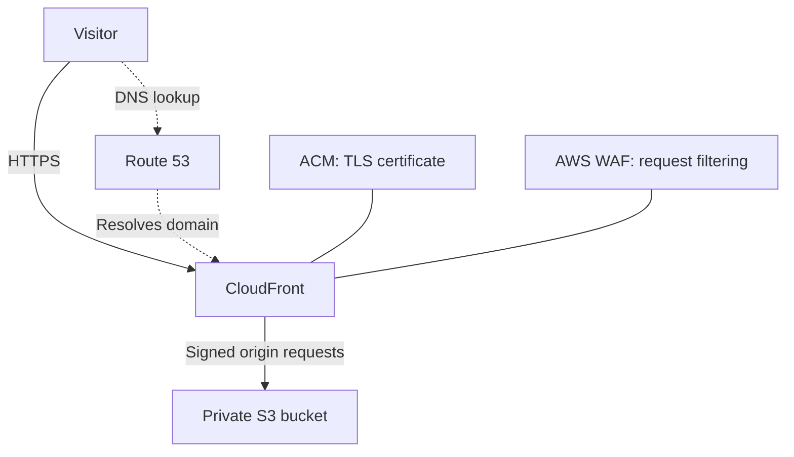

# baris.hu | AWS & Terraform Portfolio

A personal website hosted on AWS, with its infrastructure defined in Terraform. This project shows how I brought an existing cloud environment under version control and documented the decisions behind its delivery, security and state management.

**[View the live website](https://baris.hu/)**

## At a glance

| Project area | Details |
| --- | --- |
| **Purpose** | Manage the infrastructure behind my personal portfolio using Infrastructure as Code |
| **Technologies** | Terraform, Amazon S3, CloudFront, Route 53, ACM, AWS WAF and Git |
| **My work** | Import existing resources, connect resource dependencies, configure access controls and define remote state storage |
| **Skills demonstrated** | AWS networking and security, Terraform adoption, DNS, HTTPS and infrastructure change management |

## What I did

The website already existed in AWS. I used Terraform import blocks to bring its resources into code, preserving their identities instead of rebuilding the environment.

- Defined the website bucket, CloudFront distribution, DNS records, TLS certificate and WAF configuration in Terraform.
- Replaced fixed resource references in access policies and DNS configuration with Terraform resource dependencies.
- Restricted S3 origin access to the website's CloudFront distribution using Origin Access Control and a bucket policy.
- Defined a separate Terraform state bucket with encryption, versioning, public access blocking and a policy requiring HTTPS.
- Configured the S3 backend for native state locking and restricted provider operations to the intended AWS account.
- Added destruction guards for key resources and outputs for deployment details.

These implementations can be reviewed directly in the configuration files below. The repository alone does not confirm the current live Terraform state or completion of the backend migration.

## How the website works

Route 53 resolves the domain. CloudFront delivers the website over HTTPS, serves cached content and retrieves files from the private S3 origin. ACM provides the certificate, while AWS WAF applies managed request-filtering rules.

Terraform state uses a separate S3 bucket, keeping infrastructure state apart from website content.

## Why I made these choices

| Decision | Reason and trade-off |
| --- | --- |
| **Import existing resources** | Bring the environment under Terraform management while preserving resource identities. Plans still need review for unintended changes. |
| **Private S3 origin** | Serve visitors through CloudFront and restrict direct access to website objects. |
| **Separate, versioned state storage** | Keep state away from website content and retain recovery versions. Locking coordinates concurrent Terraform operations. |
| **Single-page fallback** | Unknown paths intentionally return `index.html`. Missing assets can also return HTML, so a successful HTTP status alone is insufficient for validation. |

## Explore the implementation

| Area | Files |
| --- | --- |
| Existing-resource imports | [imports.tf](imports.tf) |
| Website delivery and private origin access | [cloudfront.tf](cloudfront.tf), [oac.tf](oac.tf) |
| Bucket security and WAF rules | [security.tf](security.tf) |
| DNS and certificates | [route53.tf](route53.tf), [dns.tf](dns.tf), [acm.tf](acm.tf) |
| Remote state configuration | [backend.tf](backend.tf), [state-storage.tf](state-storage.tf) |
| Providers, variables and outputs | [main.tf](main.tf), [variables.tf](variables.tf), [outputs.tf](outputs.tf) |

## Project scope

This repository focuses on infrastructure. Website content deployment is handled separately. An automated deployment pipeline, end-to-end monitoring and alerting, and tested recovery procedures are planned improvements.

The configuration targets my existing AWS environment, rather than a general-purpose deployment template. It requires Terraform **>= 1.10, < 2.0** and AWS provider **6.x**. Backend settings, account restrictions and import IDs must be reviewed before reuse. Credentials, Terraform state and saved plans must stay outside Git.

## About me

I am **Muhammed Baris Ekinci**, an IT Service Desk Analyst at **Tata Consultancy Services** and an **AWS Certified Solutions Architect - Associate**, certified in September 2026.

I am building on my AWS and Linux experience to move into **CloudOps or junior cloud engineering**. This project is part of my practical portfolio, demonstrating how I translate AWS knowledge into maintainable infrastructure configuration.
